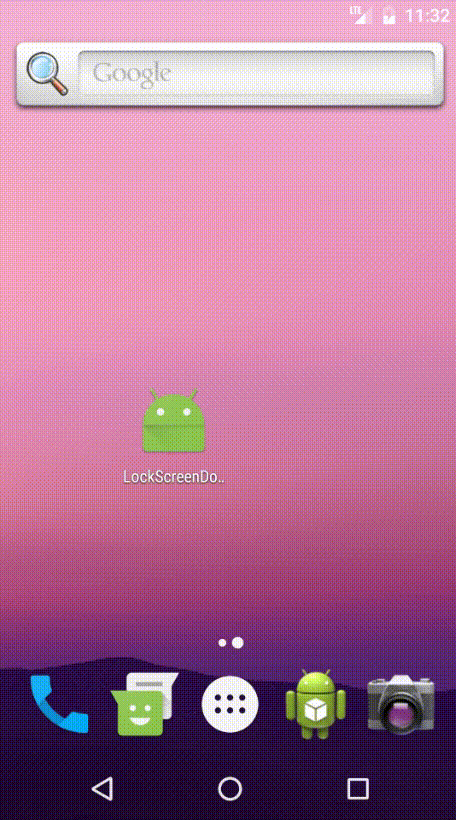

# Lock Screen

在关闭屏幕时启动一个Activity覆盖锁屏界面，可用于音乐播放器等。

## 使用指南

- 依赖（~~直接git clone吧~~）
- 锁屏时弹出的Activity需要继承`LockScreenActivity`，且**需要在manifest文件里面声明`launchMode`为`singleInstance`**
- 在`Service`的`onStartCommand`或者`Application`的`onCreate`中实例化`LockScreenManager`，并enable。在`onDestroy`中disable掉。

`Service`的写法参考[`LockScreenService`](app/src/main/java/com/helloworld/lockscreendome/LockScreenService.java)，`Application`的类似

## 效果

大佬们也可以看看源码自己实现，要点如下：
- Activity的Flag（`FLAG_DISMISS_KEYGUARD`,`FLAG_SHOW_WHEN_LOCKED`,`FLAG_ALLOW_LOCK_WHILE_SCREEN_ON`）
- 注册Receiver（**注：只能代码注册，写在manifest里面无效**，详见[这里](https://developer.android.google.cn/reference/android/content/Intent.html),页面内搜`ACTION_SCREEN_OFF`）
- Activity的`launchMode`只能为`singleInstance`

## 最后

很惭愧，就撸了一点微小的代码
